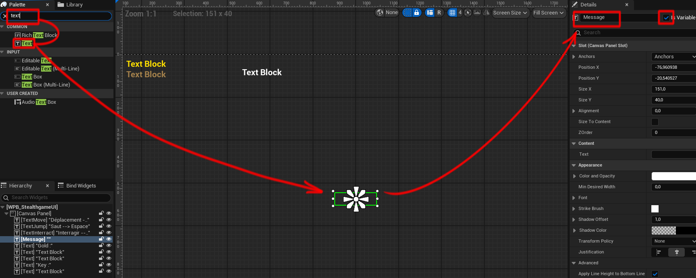

# 7 - Messages

En plus des informations de l'interface utilisateur affichées en permanence, nous souhaitons pouvoir afficher des **messages temporaires** à l'écran. Ces messages sont essentiels pour que le joueur comprenne ce qu'il doit faire.

Pour implémenter cette nouvelle fonctionnalité au projet, nous allons améliorer notre UI en créant un nouvel élément : le **HUD**.

### Créer le HUD

Ouvrez les Paramètres du monde et choissisez le gamemode par défaut (Gamemode Override). 
Plus bas, vous verrez une section HUD vide, créer un nouveau HUD.

> Le HUD sera automatiquement choisis comme HUD par défaut.

Maintenant, nous allons remplacer les scripts précédents du WPB_UI pour l'améliorer et intégrer le HUD : 

Ouvrez le HUD et ajoutez-y un script pour initier la création du WPB_UI. 

Désormais, supprimez le code superflus dans le Level Blueprint. En effet, le HUD prend en charge cet évènement avec ce que nous avons ajouter plus haut.

### intégrer le texte de message 

Dans le **WPB_Stealthgame_UI**, ajoutons un nouveau texte que nous allons nommé **Message**.

C'est ce texte qui affichera le message. Placez-le à un endroit bien visible, par exemple, au centre de l'image.

### La Macro Show Message

Nous allons maintenant créer une **Macro** destinée à afficher temporairement des messages à l'écran.
Dans la **MacroLibrary**, créez une nouvelle macro appelée **ShowMessage**.

ShowMessage prend deux paramètres : un **Text** MessageText et une **durée** Duration.
Cette macro modifie temporairement le texte affiché dans l’interface utilisateur, puis rétablit son état initial après la durée spécifiée.

Dans le **Level Blueprint**, essayez cette nouvelle Macro en affichant un message au début du jeu, indiquant le but du niveau.

Grâce à la Macro, il est possible d'intégrer rapidement et facilement des messages dans le jeu, offrant une grande possibilité de mise en scène pour conférer des informations au joueur.

> Exemple d'utilisation possible : créer une cinématique lorsque le joueur entre dans une salle pour lui faire comprendre ce qu'il dois faire.

Les messages sont un outil très important, que vous pouvez allier aux cinématiques pour créer des évènements intéressants dans le jeu. C'est essentiel pour faire comprendre au joueur quoi faire. 

[8 - Laser](https://github.com/g404-code-gaming/Stealthgame/blob/main/8%20-%20Lasers.md)

